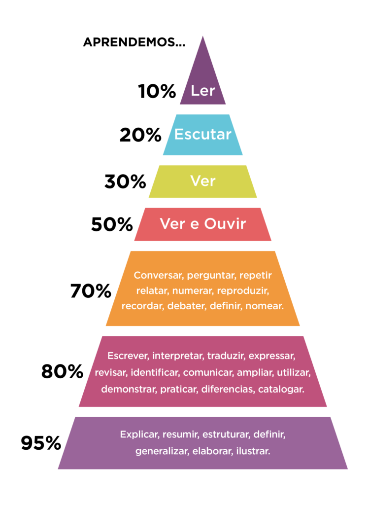

# Aulas da faculdade

Olá, Esse é um repositório com o resumo dos conteúdos abordados nas aulas de ciência da computação, na Anhembi Morumbi, se sinta a vontade para verificar o conteúdo, além de contribuir!

## Como eu estudo?

No momento, consumo as aulas de forma pausada, tentando produzir algo com aquilo que absorvi, nesse caso estou produzindo esse material.

## Piramide da aprendizagem, William Glasser

Como podem observar, oque estou fazendo aqui é utilizar meus momentos de estudo para produzir mais material de apoio, e tentar atingir os 95%.                               