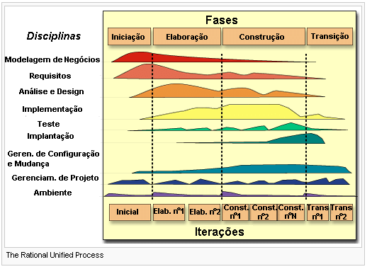

# Engenharia de Software I

## Oque é?

A engenharia de software é um ramo que busca conhecer e desenvolver as melhores praticas e técnicas para a construção de um software.

Como se constrói um software? Quais são as técnicas? As boas praticas? Como transformar uma ideia abstrata e distante em pastas, arquivos, código e uma extensa lista de tarefas?

Essa e uma infinidade de outras questões são estudadas na area, se algum dia voce tentou codar algo, mas não soube como avançar, se já se questionou se esta fazendo as coisas da "forma certa" e se já abandonou pela metade diversos projetos esse é um bom ponto de partida para se tornar um desenvolvedor melhor.

> Como engenheiros de software, utilizamos nossos conhecimentos para resolver problemas.

## Desenvolvimento profissional de software

Ao desenvolver um software, temos algumas funções básicas, sendo elas:

1. **Gerente de projetos**: Lida com a parte gerencial do projeto, aplicando boas praticas e metodologias, guiando a equipe para tirar os obstáculos do caminho.

2. **Analista de sistemas**: É o principal profissional dentro da disciplina de engenharia de software, é ele que tem o contato inicial e final com o cliente, gerando requisitos, gráficos e diagramas.

3. **Desenvolvedores**: Esses recebem os artefatos gerados pelo analista e transformam em código propriamente dito.

4. **Testers**: Programadores que buscam falhas dentro do software. 

> Esses não são os únicos cargos, mas são os principais quando pensamos em desenvolvimento de software.

## Modelos de desenvolvimento de software

### Oque é?

Ajudam a definir as etapas, objetivos e responsabilidades durante o desenvolvimento de um software.

### Processo unificado

O processo unificado é uma tentativa de aproveitar as melhores características dos modelos anteriores.

Ele é muito bom para ter uma ideia de quanto de mão de obra de cada profissional será necessário para um projeto de software.

Podemos perceber aqui que existem diversas interações com o cliente, onde a cada iteração um incremento é feito no sistema. Podemos então dizer que esse sistema é interativo e incremental.

Leia [aqui](https://pt.wikipedia.org/wiki/Processo_unificado) um texto muito util na Wikipédia sobre o UP.

> Parei em 06:00, na Engenharia de software unidade I